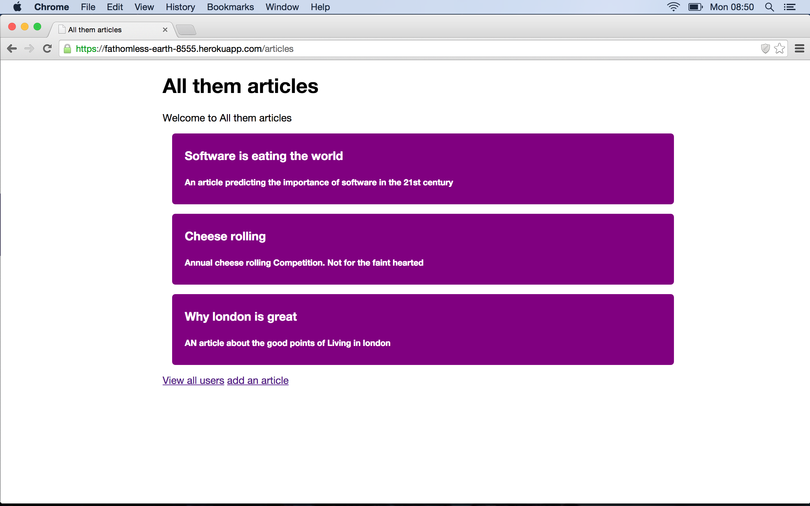

First Nodejs App
================


Another simple bookmark manager this time written in node.js.

[Click here](https://fathomless-earth-8555.herokuapp.com/articles) to check it out online




Skills learnt/used
-----------------
> * Javascript
> * node.js 
> * sequelize
> * postgress
> * heroku
> * Html5
> * CSS3


How to use
----------

Clone the repository:

```shell 
$ git clone git@github.com:benjamintillett/wherewasi.git
```

And play around with the code

create the database:

```shell 
$ psql
psql=# create database "nodejs-development";
```

Run the server:

```shell 
$ npm start
```


